# Scratch - Bågskytten Hans-O

Hans-O (Hans-Olov) ska stå på en mur och försvara sig mot Mulle-vadarna som kommar fram ut sina hål och attackerar honom.
Kommer Mulle-vadarna fram till muren och slår på den så går den till slut sönder och Hans-O besegras. 
Så Hans-O ska kunna skjuta pilar på Mulle-vadarna som då försvinner.

Utveckling: https://scratch.mit.edu/users/Ratcher05/

Grafik: https://scratch.mit.edu/users/MaEk_Animations/

[Presentation (Google slides)](https://docs.google.com/presentation/d/1tH18PLq121Lf-I-n7h0owph1vQ9ijZxFO6_KBWH7MSA/edit?usp=sharing)

## Förberedelser
* Hitta igen följande projekt och spara ner alla sprites i din ryggsäck: [https://scratch.mit.edu/projects/200419789/](https://scratch.mit.edu/projects/200419789/)
* Skapa ett nytt projekt. 
* Rensa bort katten.
* Skapa en bakgrund. 
Det viktiga är att muren är grå och gräset en annan:

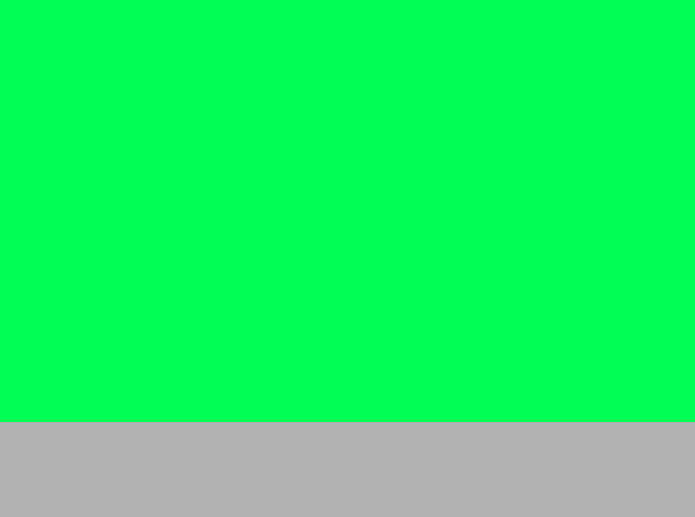

## Hans-Olof

### Lägg till Hans-Olof
Vill vill att Hans-O står i mitten av muren och alltid tittar mot muspekaren.

Flytta in Hans-O från ryggsäcken till ditt projekt

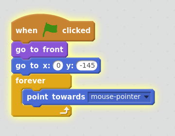

### Beväpna Hans-O
Hans-O ska ha en pil laddad som alltid är riktig mot muspekaren.
Flytta in pilen från ryggsäcken.

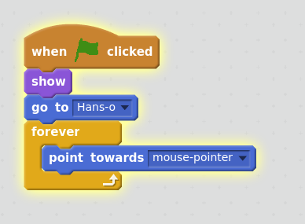

### Skjut pilen
Pilen ska skjutas i riktning mot muspekaren.
  
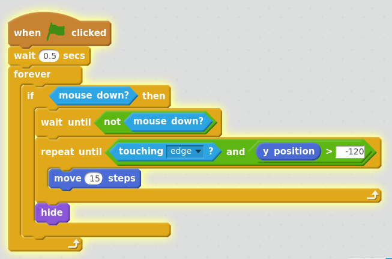

Problem: Vi skjuter bara en pil i taget och det beter sig konstigt då den når muspekaren.
Vi kommer lösa det senare.

## Mulle-vadarna
Flytta in Mulle-vaden från ryggsäcken.

### Få Mulle-vaden att röra på sig.
Mulle-vaden ska hela tiden gå (animera)

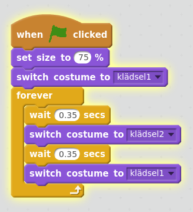

### Mulle-vaden ska komma på slumpmässiga platser
När Mulle-vadarana placeras på skärmen så ska det vara slumpmässigt var de hamnar.
Mulle-vadarna ska också sluta gå då de kommer fram till muren eller blir träffade av pilen.

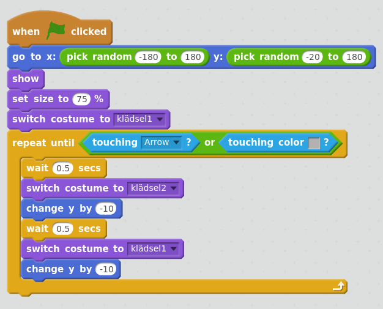

## Flera pilar
Vi vill kunna skjuta flera pilar om det kommer många Mulle-vadar

### Pilen ska försvinna vid träff
Börja med att lägga till att om en Mulle-vad träffas av en pil så pilen försvinna.
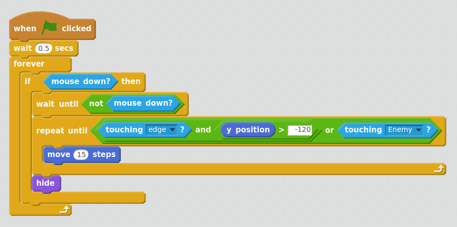

### Flera pilar

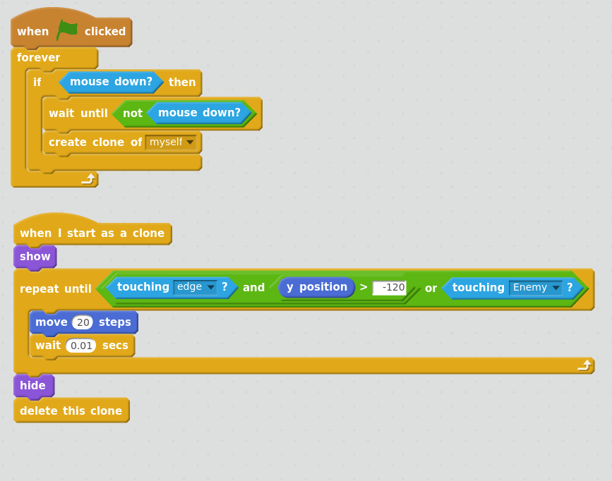

## Flera Mulle-vadar
Det här blir ganska mycket ändringar men vi visar det bit för bit.

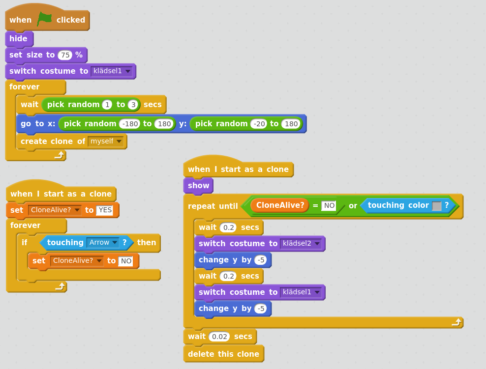

### Mulle-vaden försvinner
När Mulle-vaden blir bekämpad så ska den försvinna.

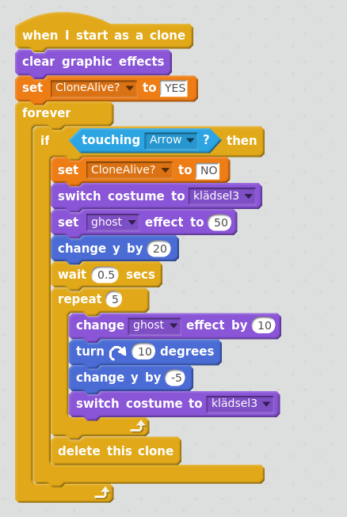

## Mulle-vadarna gräver sig upp
### Visa hålen
Lägg till hålen från ryggsäcken och kopiera koden från hur Mulle-vadarna kommer fram.

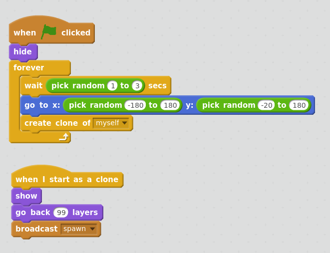

### Mulle-vaden kommer till hålet
Detta funkar inte men är en första version

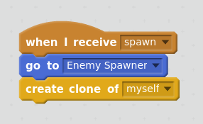

### Inga kloner ska flyttas till hålet
Vi kollar så att om man inte är en clone så får man flyttas

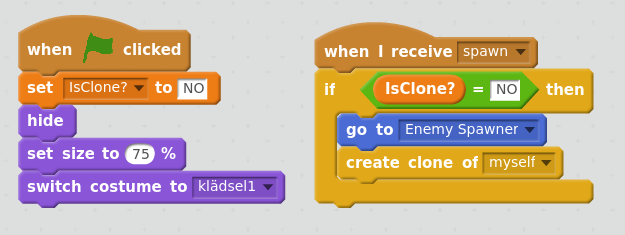

### Animera hålen
Hålen kommer fram och försvinner efter ett tag.

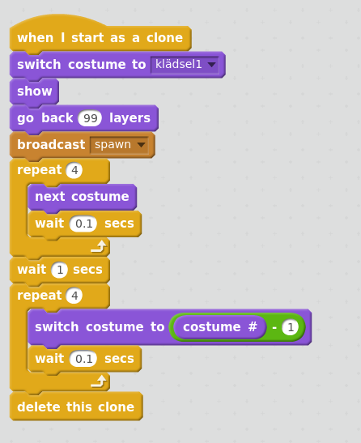

Kom ihåg att lägga till en sleep på 1.3 sekunder för varje "when I start as a clone" i Mulle-vadarna

## Extra saker
* En "Game Over" skärm
* Livspoäng på muren
* Skjuta ult då man bekämpat ett antal Mulle-vadar.

 

